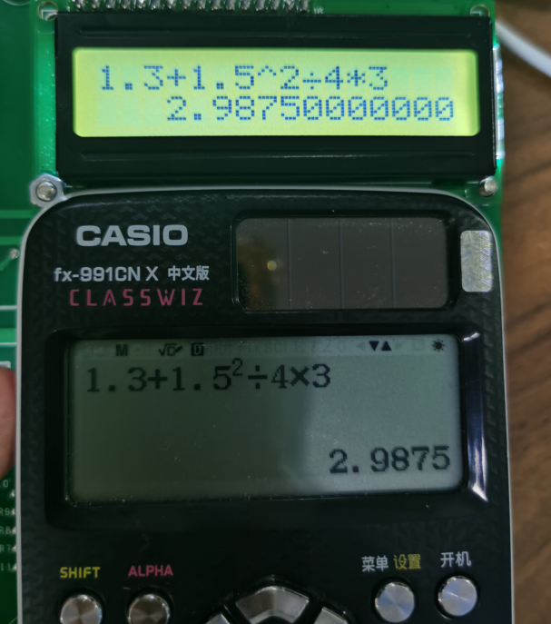
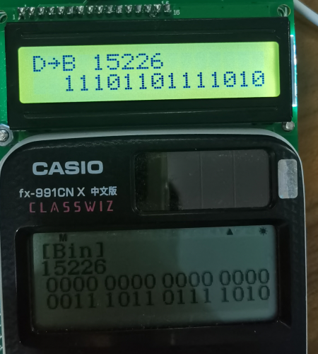

12位多功能高精度计算器
功能说明书：

本计算器为多功能12位精度计算器，可以进行加、减、乘、除、开方、乘幂、进制转换等运算功能，同时具有退格功能、输入限位、错误提示（包括语法错误、数学错误、进制转换时的溢出错误）等功能。
计算器具有两个模式：科学计算模式与程序员模式，其中不同模式的操作说明如下：
1. 12位精度计算模式：
   该模式下用户可进行四则运算与乘幂、开方等计算，按键说明如下：
   |     7    	|     8    	|     9    	|     +    	|     ^    	|
   |----------	|----------	|----------	|----------	|----------	|
   |     4    	|     5    	|     6    	|     -    	|     √    	|
   |     1    	|     2    	|     3    	|     *    	|     T    	|
   |     0    	|     .    	|     =    	|     /    	|     ←    	|
   【常规输入】
   用户可在屏幕上方输入待求表达式，输入完毕时按下等于键，即可在第二行输出结果：
   
   此时按下任意键可重新输入计算式进行计算。
   【错误处理】
   用户在输入错误的表达式时，计算器蜂鸣器及LED灯会发出警报，在普通计算模式下错误有以下两种：
   (1) 语法错误（Syntax Error）：此错误是由用户输入了错误的表达式所导致，如以下的表达式：
   同一个数中出现了多个小数点：
   1..2+3
   表达式首位为运算符：
   +2/5×3
   连续出现两位运算符：
   1.5×+2
   计算式最末位为运算符：
   14-25+
   这几种情况系统将判定输入计算式出现了语法错误，声光提示并在显示器显示"Syntax Error!"，此时按任意键可返回；
   注：参考Casio fx-991计算器输入标准，以下左边几个输入式将不被判定为语法错误，并自动补全为右式计算返回结果：
   2.+3 -> 2.0+3=5
   2√5 -> 2×√5=4.472135955
   .93/3 -> 0.93/3=0.31
   48×.5 -> 48×0.5=24
   (2) 数学错误（Math Error）：此错误是用户输入了数学上无法求出的表达式导致的，具体错误有如下几种：
   除数为0（注意，此时若除数过小，小于精度1e-8时依然视为0，输出数学错误）：
   2/0
   幂底与幂指数同时为0：
   0^0
   这几种情况系统将判定输入计算式出现了数学错误，声光提示并在显示器显示"Math Error!"，此时按任意键可返回；
   【输入限位】
   计算器具有退格键，若用户误输入数据可通过退格键清除最末尾一位。但当输入表达式为空时，此时继续按退格键会触发限位警告，声光提示，输入无效。
   计算器表达式输入位有限制，系统初始化时设定为30位，当表达式输入位数超过此位时，系统将触发限位警告，声光提示，输入无效。

2. 程序员模式：
   该模式下用户可进行整数的二进制、八进制、十进制与十六进制间的转换，按键说明如下：
   |     7    	|     8    	|     9    	|     A    	|     E        	|
   |----------	|----------	|----------	|----------	|--------------	|
   |     4    	|     5    	|     6    	|     B    	|     F        	|
   |     1    	|     2    	|     3    	|     C    	|     Shift    	|
   |     0    	|          	|     =    	|     D    	|     ←        	|
   【常规输入】
   用户可在屏幕上方输入待求数字，输入完毕时按下等于键，即可在第二行输出结果：
   
   此时按下任意键可重新输入计算式进行计算。
   【模式切换】
   用户可以在二进制、八进制、十进制、十六进制之间进行转换，此时需要先按下图3所示的SHIFT键，即可在不同模式间进行切换。切换完毕后，用户需要重新输入数字进行进制转换。
	此时按键布局变更如下：

      |     B→H    	|     O→H    	|     D→H    	|     H→H    	|              	|
   |------------	|------------	|------------	|------------	|--------------	|
   |     B→D    	|     O→D    	|     D→D    	|     H→D    	|              	|
   |     B→O    	|     O→O    	|     D→O    	|     H→O    	|     Shift    	|
   |     B→B    	|     O→B    	|     D→B    	|     H→B    	|     ←        	|
   【错误提示】
   该模式下限位提示与计算模式相同，此时输入位被设定为12位，超过12位时触发限位警告，声光提示，输入无效。
   该模式下输入数字有大小限制，由于显示屏第二行仅有16位，当输入的数字（十进制）超过65535时，系统将判定输入数字触发了溢出错误，声光提示并在显示器显示"Overflow Error!"，此时按任意键可返回。
